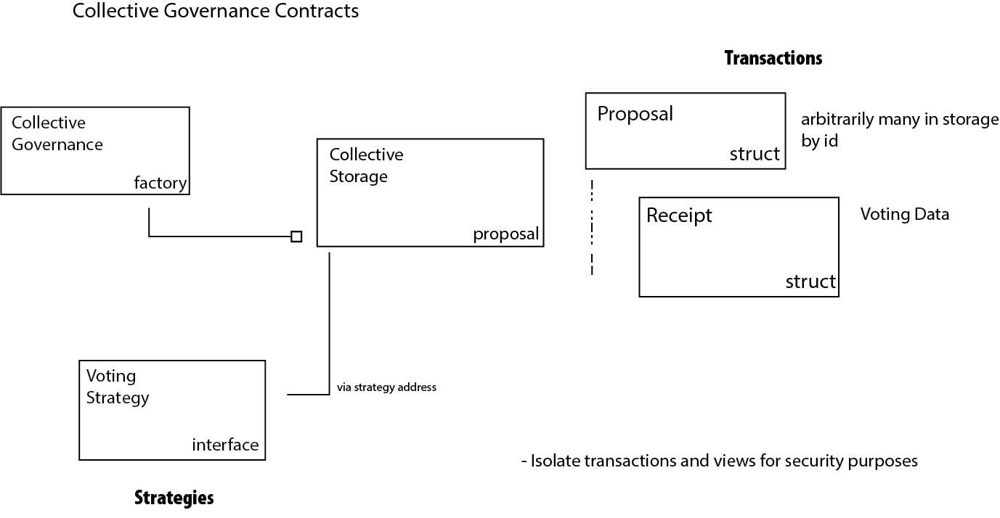

# collective-governance-v1

## Open Smart Contract for Community Governance

Open communities exist to serve the common good and therefore should be given an opportunity to make collective decisions about how resources are used or allocated. Such decisions, referred to as 'measures' augment participation and enable communities to become benefactors on a broader scale.

This smart contract enables a measure to be proposed, voted upon and successfully fulfilled. It also provides safety measures to prevent tampering, invalid election design or unexpected system problems from nullifying the possible benefit of a given measure.

### Contract Deployment Details

0.8.1

```
forge create --contracts contracts/CollectiveGovernance.sol --rpc-url ${DEVNET_RPC} --private-key ${DEVNET_WALLET} --etherscan-api-key ${ETHERSCAN_API_KEY} --verify CollectiveGovernance
Compiling 23 files with 0.8.16
Solc 0.8.16 finished in 106.73s
Compiler run successful
Deployer: 0x6CEb0bF1f28ca4165d5C0A04f61DC733987eD6ad
Deployed to: 0x833b33A274DB2b26a030bEF1DF0A3981f01C1364
Transaction hash: 0x6208b1cd80f24dd95a05b3d7c9b9b08ce8b365fe2380a68ea493cf95584a1dbe
Starting contract verification...
Waiting for etherscan to detect contract deployment...
Submitting verification for [contracts/CollectiveGovernance.sol:CollectiveGovernance] Ok("0x833b33A274DB2b26a030bEF1DF0A3981f01C1364").
Submitting verification for [contracts/CollectiveGovernance.sol:CollectiveGovernance] Ok("0x833b33A274DB2b26a030bEF1DF0A3981f01C1364").
Submitting verification for [contracts/CollectiveGovernance.sol:CollectiveGovernance] Ok("0x833b33A274DB2b26a030bEF1DF0A3981f01C1364").
Submitted contract for verification:
	Response: `OK`
	GUID: `a9uaapvndtyz3emtpihzpksmebkat3tdmb14zag68fppcpt4r2`
	URL:
        https://goerli.etherscan.io/address/0x833b33a274db2b26a030bef1df0a3981f01c1364
Waiting for verification result...
Contract source code already verified
```

### Model



### Design Aims

    * Introduce a smart contract that enables on chain proposal of measures, along with conclusive determination of the community support for the measure and potential fulfillment of the aim of a measure.  For example execution of a transfer.
    * Require participation in measure outcome that is restricted to a pre-selected audience of participants
    * Support audiences specified by ownership of a particular token, list of wallets or general population
    * Voting works with the existing ERC-721 standard.  Existing NFTs can form a voting class and participation does not require any contract specialization.  ERC721Enumerable is also supported.
    * Provide safe, fair and verifiable measure outcomes
    * Contract is very literate, information is transparent without prior knowledge
    * Support for execution of a transaction on successful outcome
    * Each community has their own storage/contract address, which are isolated from one another, people can e.g. query the contract address for all the proposals, each communities proposal IDs start at index 1
    * Tokens can’t vote twice, even when transferred to another wallet
    * Allow veto at any time while voting is underway
    * Provide no special authority to the contract owner.   Once in motion a measure may not be tampered with

### Contract Requirements

Collective governance is implemented as a hierarchical set of tiered contracts. An initial function is implemented to create a contract which enables and supports the voting on a particular measure from election setup through conclusion or veto.

The creation stage uses addresses to specify a set of election supervisors who are responsible for establishing the characteristics and lifecycle of the proposed measure. The supervisor will determine the voting class, i.e. particular tokens or other characteristics that specify who is allowed to vote. They will specify the required number of votes to pass the measure and they will then open the voting and allow the measure to succeed or fail.

Negative votes are automatic and do not require gas. Any measure must reach the threshold specified by a supervisor in order to pass. Any supervisor may veto the measure at any time during voting thus nullifying the outcome of the measure. The vetoed measure is effectively void with no result.

Any voter is allowed to change their mind and cast a negative vote while the voting remains open.

### Functional Requirements

1. Contract owner is required to add an election supervisor, but has no other capabilities
2. Arbitrary number of election supervisors are supported
3. Supervisor may add voter by address or add voter class (by token address), but may not vote or undo votes
4. Supervisor may remove voter or voter class for measure prior to start of voting
5. Supervisor may begin and end the voting process
6. Supervisor may set the fixed threshold (number) at which the measure is considered successful
7. No changes are permitted once voting is open, the voter context is final and voter can be assured against manipulation of the rules during the voting process
8. Voter may cast an affirmative vote once voting has been opened. A negative or abstention vote is never required and therefore incurs no gas fees. Vote total is tallied according to Voter class membership, i.e. number of held tokens for ERC-712, or 1 for general public
9. A voter may undo their vote at any time while voting is open
10. No votes or vote changes (undo) are allowed after voting has ended
11. Supervisor may veto the measure prior to the end of voting to ensure the outcome of the measure aligns with the collective interest
12. A vetoed measure has no result and effectively is void
13. A token may only be used one time to verify membership in a voting class. A transferred token has no particular rights if another has already participated in this measure
14. All successful operations are verifiable on chain

### Terminology

Measure - A goal or aim initiated by the community
ElectorDelegate - A contract responsible for community participation in voting on a measure
Voter - A community member, who may be a member of a special subclass (ERC-721 token), participating in the outcome of the measure
Supervisor - A steward for the measure to enable the community to come to a valid conclusion
Owner - the initial contract creator who has no special authority over the outcome of any particular measure

#### Quick Start for Developers

    1. docker build . -t eth-community-v1:1

#### VS Code

    `Reopen in Container`
