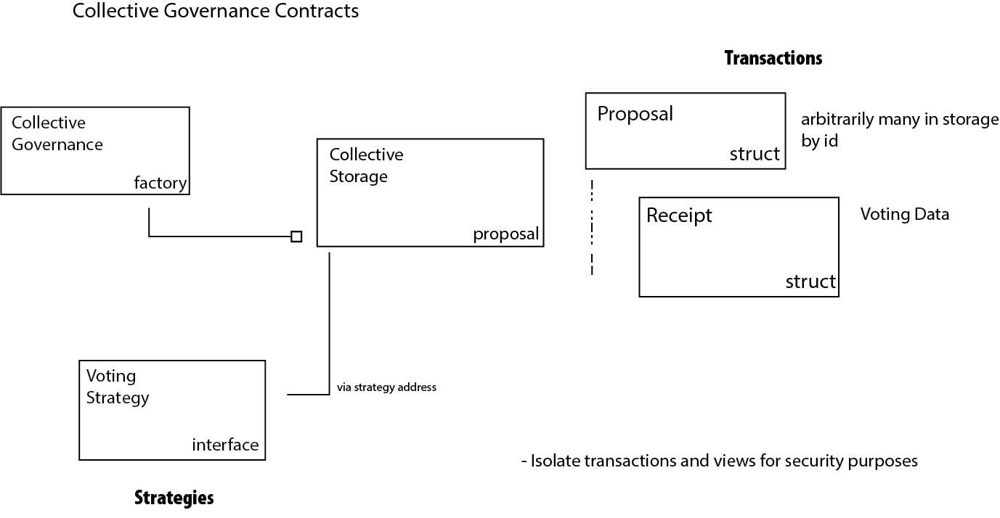

```
                         88  88                                   88
                         88  88                            ,d     ""
                         88  88                            88
 ,adPPYba,   ,adPPYba,   88  88   ,adPPYba,   ,adPPYba,  MM88MMM  88  8b       d8   ,adPPYba,
a8"     ""  a8"     "8a  88  88  a8P_____88  a8"     ""    88     88  `8b     d8'  a8P_____88
8b          8b       d8  88  88  8PP"""""""  8b            88     88   `8b   d8'   8PP"""""""
"8a,   ,aa  "8a,   ,a8"  88  88  "8b,   ,aa  "8a,   ,aa    88,    88    `8b,d8'    "8b,   ,aa
 `"Ybbd8"'   `"YbbdP"'   88  88   `"Ybbd8"'   `"Ybbd8"'    "Y888  88      "8"       `"Ybbd8"'
```

# collective-governance-v1

- [Read the Docs](https://collectivexyz.github.io/collective-governance-v1/)

## Introduction

Governance smart contracts are a type of smart contract that allow a community to influence an on-chain governance system or treasury through voting. They can be used to define who participates in the decision-making process, how votes are weighted and counted, and what actions can be taken based on the outcomes. Governance smart contracts can also provide security and transparency for the participants, as well as enable innovation and flexibility for the group or collective.

However, governance smart contracts also face some challenges and limitations. For example, they may require a high level of technical expertise and trust from users, they may be vulnerable to attacks or bugs, and they may not be able to capture all the nuances and complexities of human interactions and agreements. Therefore, governance smart contracts need to be carefully designed, tested and audited before deployment.

Collective Governance attempts to address all of the above concerns by providing an on-chain voting system with flexible plug-and-play community definitions and easy building blocks for creating communities. Communities may each determine the rules for voting and interacting separately from one another without requiring code changes, reviews or deployments. Collective Governance also provides a pluggable mechanism for defining the community itself, possibly as membership in a pre-defined voting pool or as a collective who all hold a particular token.

Collective Governance has been designed from the ground up to be very easy to use. It uses an easily-understandable building block approach to creating a community and managing proposals and voting on that community. Therefore Collective Governance addresses many of the concerns and issues present in existing Governance contracts.

## Quick Start

### Contract Deployment Details

#### Sepolia TestNet

| Contract          | Ethereum Address                           | Version |
| ----------------- | ------------------------------------------ | ------- |
| ECDSA             | 0xe9e21aaEaEad9c57C1F4c622915fFB54f9Ebe338 | 4.9.0   |
| Constant          | 0xfF71192dcCBC5f4C3Cb2bBcB4f8885d6ba8b1466 | 0.9.11  |
| CommunityBuilder  | 0xa36e161361A16D75534d565480e62cE474BaC9f3 | LATEST  |
| GovernanceBuilder | 0x9fB5a925E61c31617129B5D030808939DADA99f7 | LATEST  |

#### Görli TestNet

##### @Deprecated

| Contract          | Ethereum Address                           | Version |
| ----------------- | ------------------------------------------ | ------- |
| Constant          | 0xE92C637eC797934574D31D319B4bD1eca182e7F1 | 0.9.7   |
| CommunityBuilder  | 0x011b543b69236aca83406edc051e8a6dd3bcda1c | 0.9.7   |
| GovernanceBuilder | 0x2c57560BF19b7c088488104D02506D87f63e414C | 0.9.7   |

### Command line build using docker

    1. docker build . -t collective-governance-v1:1

### VS Code

Using the Remote module in VSCode simply reopen the project in it's container.

    `Reopen in Container`

### Foundry

This project is using [Foundry](https://github.com/foundry-rs/foundry). Development is enabled with the [Foundry Development](https://github.com/collectivexyz/foundry) container

### JavaScript API

- [TypeScript API](https://github.com/collectivexyz/governance/pkgs/npm/governance)
- [TypeScript Reference](https://github.com/collectivexyz/collective_governance_js) implementation

## SECURITY

see [SECURITY.md](SECURITY.md)

## Open Smart Contract for Community Governance

Open communities exist to serve everyone and therefore should provide an opportunity to make collective decisions about how resources are used or allocated. Such decisions, referred to as votes or proposals, enhance enthusiasm, participation and enable communities to become benefactors on a broad scale.

This smart contract enables a vote to be proposed, voted upon and successfully fulfilled by executing on chain transactions. The contract also provides safety measures designed to prevent tampering, invalid election design or unexpected system problems from nullifying the possible benefit of a given vote.

### Example deployment

```
$ forge script ./script/DeployCollective.sol --sig 'deploy()' --libraries contracts/Constant.sol:Constant:${CONSTANT_LIB_ADDRESS} --slow --broadcast --rpc-url ${RPC_URL} --private-key ${PRIVATE_KEY} --etherscan-api-key ${ETHERSCAN_API_KEY} --verify
```

### Model



### Design Aims

    * Introduce a smart contract that enables on chain proposal of voting, along with conclusive determination of the community support for the outcome and potential fulfillment of the aims specified.  For example, a successful vote may enable execution of an on chain transfer of tokens or ETH.
    * Allow participation that is restricted to a pre-determined community of participants
    * Support audiences specified by ownership of a particular token, list of wallets or any population
    * Voting works with the existing ERC-721 standard.  Existing NFTs can form a voting class and participation does not require any contract specialization.  ERC721Enumerable is also supported.
    * Provide safe, fair and verifiable outcomes
    * Contract is very literate, information is transparent without prior knowledge
    * Support for execution of a transaction on successful outcome
    * Each community has their own storage and contract address, which are isolated from one another, people can query the contract address for all the proposals, each communities proposal Ids start at index 1
    * Tokens can’t vote twice, even when transferred to another wallet
    * Allow veto at any time while voting is underway
    * Provide no special authority to the contract owner.   Once in motion a measure may not be changed and nobody can predetermine the outcome.

### Contract Requirements

Collective governance is implemented as a hierarchical set of tiered contracts. An initial function is implemented to create a contract which enables and supports the voting on a particular measure from election setup through conclusion or veto.

The creation stage uses addresses to specify a set of election supervisors who are responsible for establishing the characteristics and lifecycle of the proposed vote. The supervisor will determine the voting class, i.e. particular tokens or other characteristics that specify who is allowed to vote. They will specify the required number of votes to pass the measure and they will then open the voting and allow the measure to succeed or fail.

Any measure must reach the quorum threshold specified by a supervisor in order to pass. Any supervisor may veto the measure at any time during voting thus nullifying the outcome of the measure. The vetoed void is effectively void with no result and it is never executable.

Optionally a voter is allowed to change their affirmative vote by undoing it while the voting remains open.

### Functional Requirements

1. Contract owner has no special capabilities
2. Arbitrary number of election supervisors are supported, project supervisors may not be deleted
3. Supervisor may add a voter class by token address or other characteristics, but may not vote or undo votes
4. Supervisor may remove voter or voter class prior to start of voting
5. Supervisor may begin and end the voting process
6. Supervisor may set the fixed quorum requirement at which the measure is considered to achieve quorum. If for votes outnumber the against votes then the vote is successful.
7. No changes are permitted once voting is open, the voter context is final and voter can be assured against manipulation of the rules during the voting process.
8. Voter may cast an affirmative vote once voting has been opened. Vote total is tallied according to voter class membership, i.e. number of held tokens for ERC-712, or 1 for general public
9. A voter may undo their vote at any time while voting is open
10. No votes or vote changes (undo) are allowed after voting has ended
11. Supervisor may veto the measure prior to the end of voting to ensure the outcome of the measure aligns with the community goals
12. A vetoed measure has no result and effectively is void
13. A token may only be used one time to verify membership in a voting class. A transferred token has no particular rights if another has already participated in this vote
14. All successful operations are verifiable on chain and executable by ending the vote

### Terminology

Vote - A goal or aim initiated by the community with the goal of observing the will of the community. Optionally, transactions may be attached to the vote which execute upon success.
CollectiveGovernance - A contract responsible for community participation in voting on a measure
Voter - A community member, who may be a member of a special subclass (ERC-721 token), participating in the outcome of the vote
Supervisor - A steward for the measure to enable the community to come to a valid conclusion
Owner - the initial contract creator who has no special authority over the outcome of any particular vote
